# Lightbulb

Lightbulb is a blog offering users and guests a page to share their innovative ideas with interested contributors and spectators.

The blog takes a simple format and comprises of two pages, a landing page where posts are available and a review page for users to leave feedback.

The idea of the website is to provide a space where individuals can discuss ideas and find other like minded individuals, including potential collaborators and investors.

The project has been designed as a deliverable for the fourth project in the Code Institutes Diploma
in Full Stack Software Development.

Logged in users can make posts, comment and like posts. Individuals who are not logged in have read only access to all elements of the website. 

There is post approval in place in order to filter posts to assure all posts are keeping inline with what the blog endeavours to provide, this assures any distasteful posts are never seen by site users. Reviews can also be deleted by admin if they are distasteful.

Link to live website -

[Lightbulb](https://lightbulb.herokuapp.com/)

## Design

The Design is purposely simple, only options that are value adding are presented to site visitors, if logged in they can instantly post using the button presented to them. Individuals who are not logged in have the option to log in or register on the navigation bar, they can do this or they can scroll and browse posts without doing so. The bottom of the page allows the user to navigate to the review page where they can leave a review if they wish. The website is fully responsive and scales to all device sizes.

## Design Features

### Authentication routes

Full range of login, logout and register functionality is available.
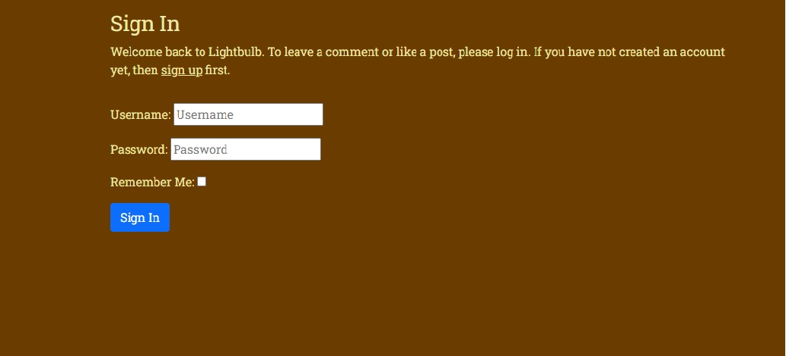

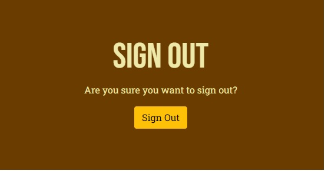

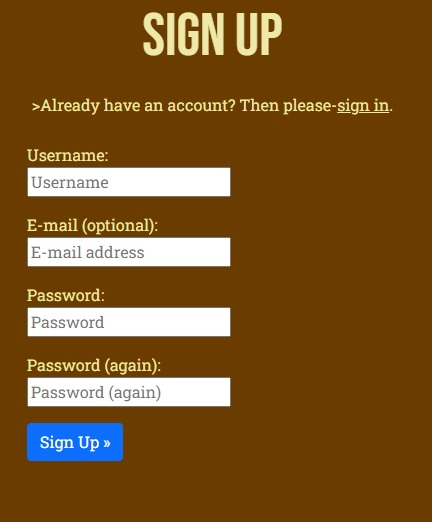

### Header

The header area of the website comprises of two elements, the navigation bar and the hero element.

#### Navigation Bar

The navigation bar sticks to the intended simplistic approach, it allows logged in users to return home by clicking the logo or to logout.

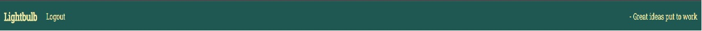

If the user is not logged in, options to return home, register an account or log in are available.

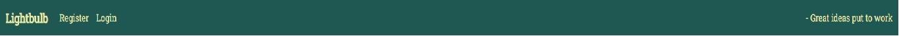

#### Hero area

The area immediately below the navigation bar uses larger font to define the website and prompts logged in users to create a post if they wish, this is replaced with an option to log in if the user is not currently logged in.

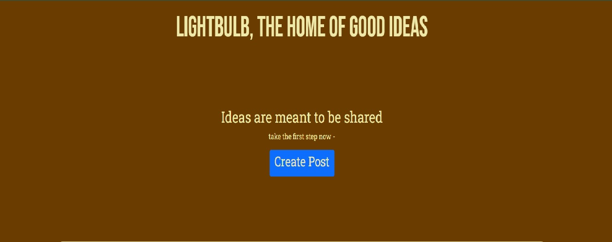

### Footer

The footer allows the user to navigate to the reviews page or to return home using the lightbulb logo.

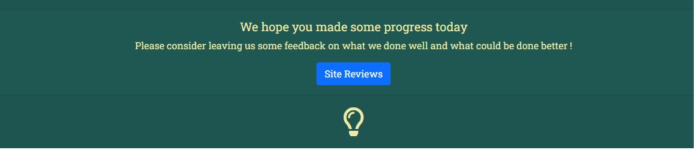

### Main Page

Each post populates using a pre decided image. Details of the Author, post subject, Date and Time are all evident from the main page.

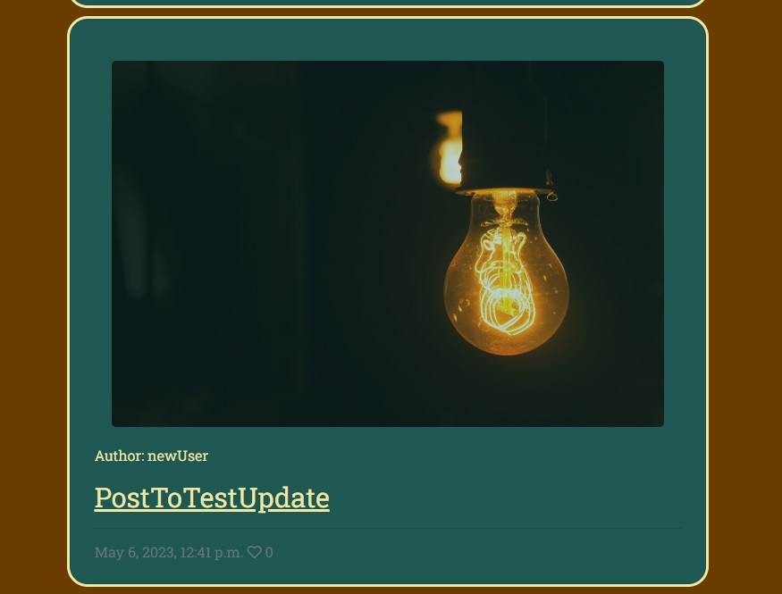

### Create Post

Simple form allows creation of a post, returns user to home page.

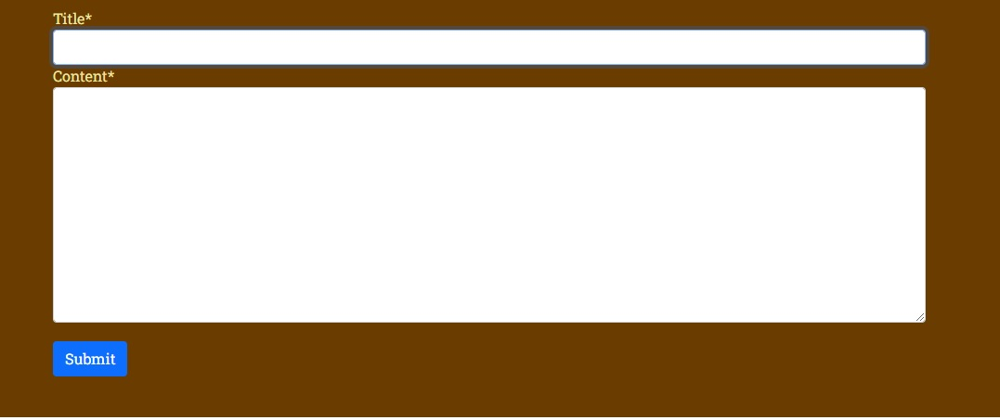

### Post Details 

If the user clicks into a post they can see the full post, if logged in they are provided options to edit and delete if they own the post and can also add a like.

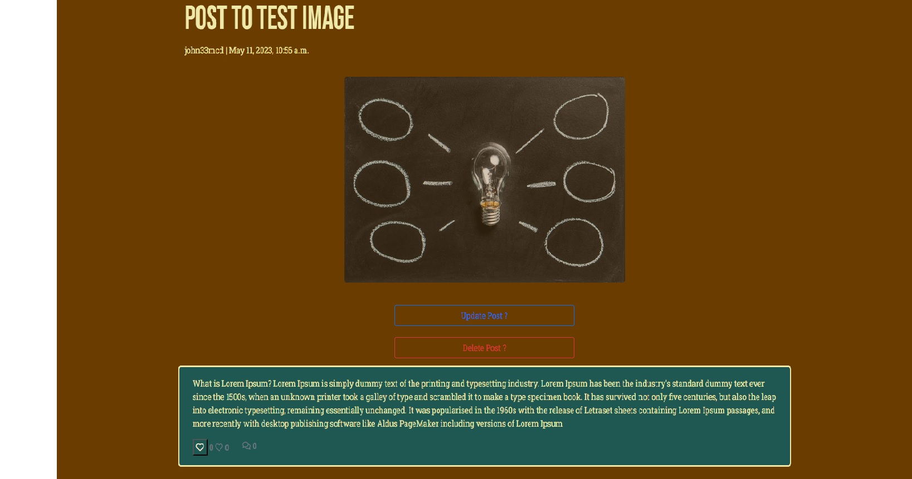

The user can also add a comment if they are logged in and see other users comments.

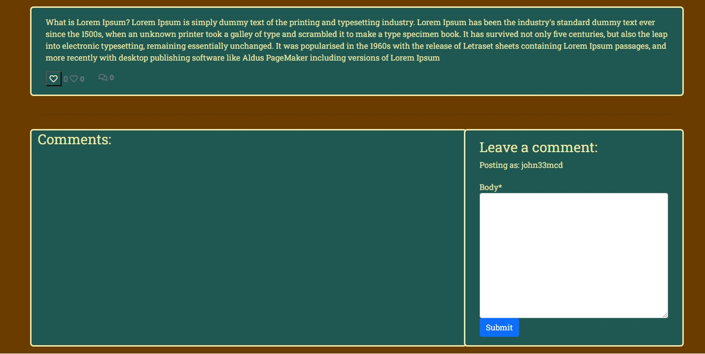

### Review Page

The review page uses the hero area to provide users the option of creating a review if they would like, they can also view other users reviews and opinion from this area.

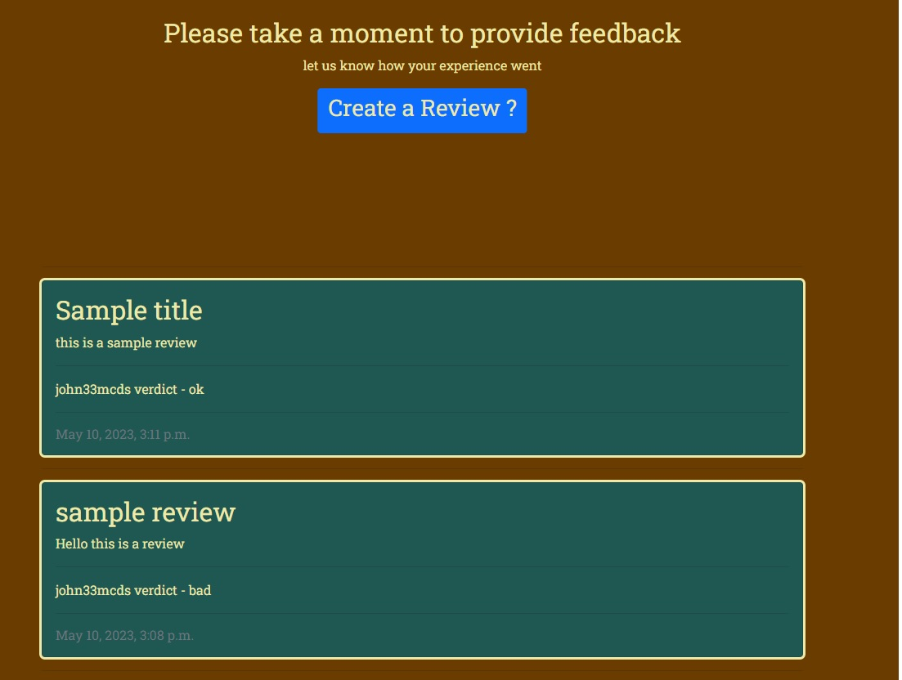

### Create Review

Simple form allows creation of a review, requesting a title, description and rating based on a drop down menu. Returns user to home screen upon posting.

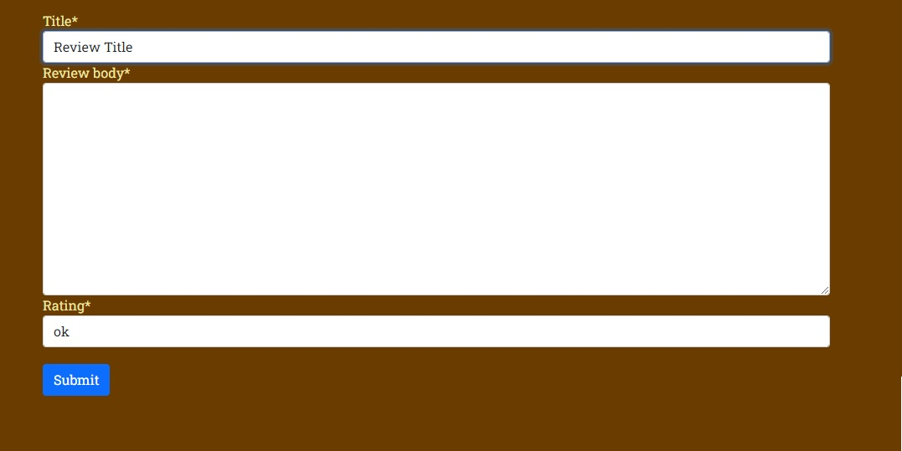

### Palette

The palette that has been used is a mix of solid, complimentary colours so as to not over complicate or take away from the blog aspect of the website

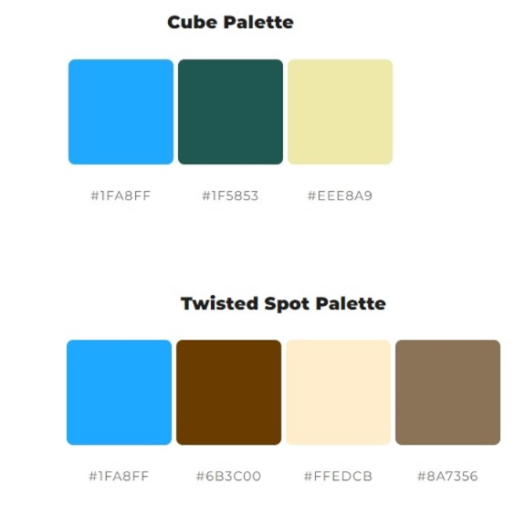

### Fonts

Utilised the following fonts from google fonts -

font-family: 'Bebas Neue', cursive;
font-family: 'Roboto Slab', serif;

### Flowchart - intended website build 

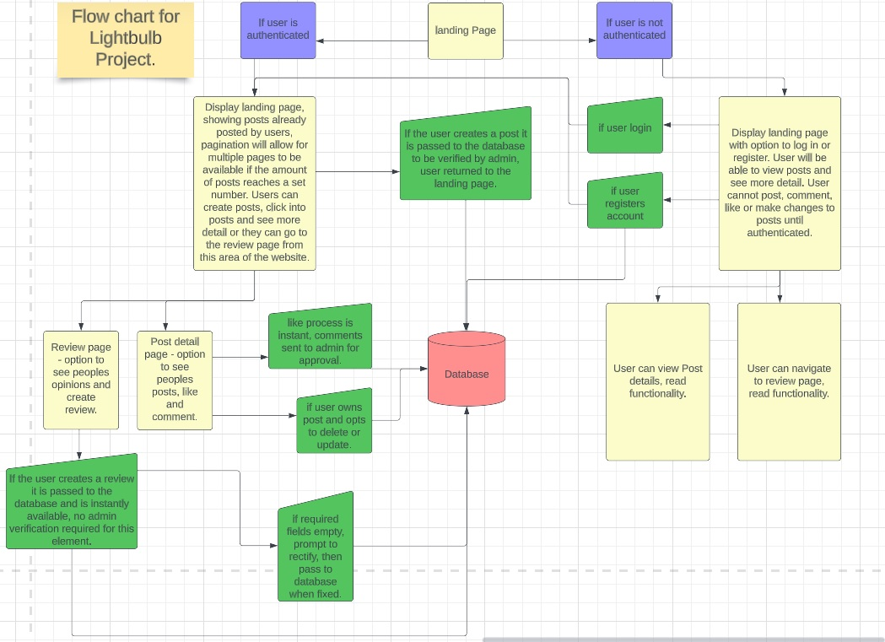

### Wireframes

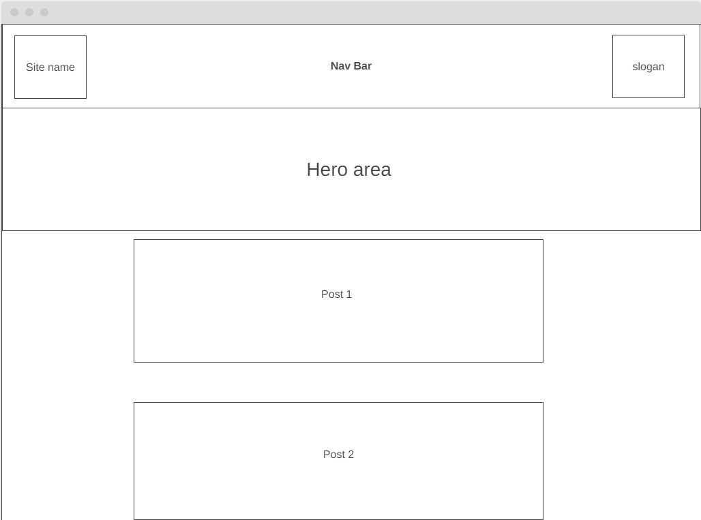
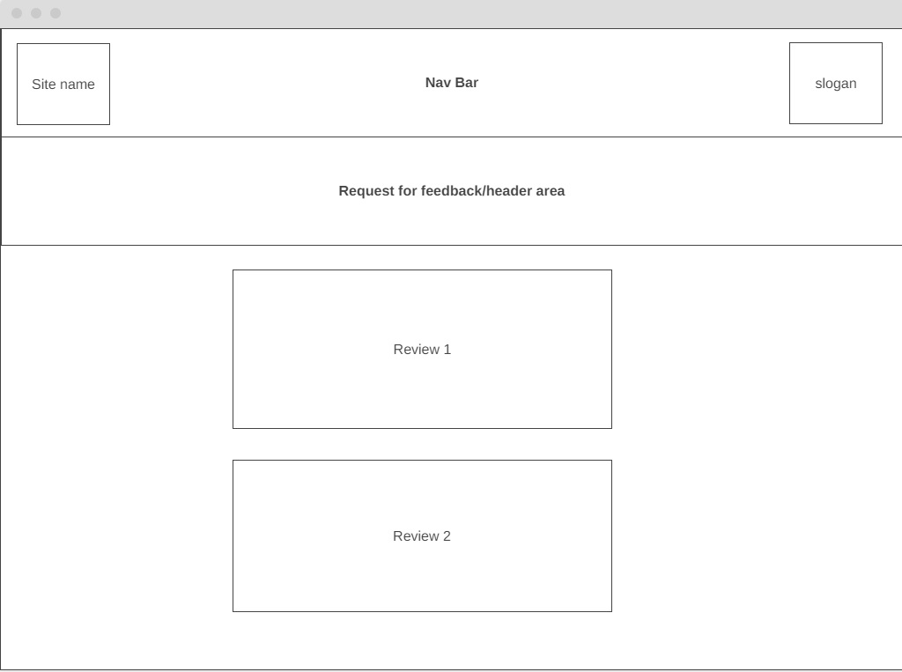

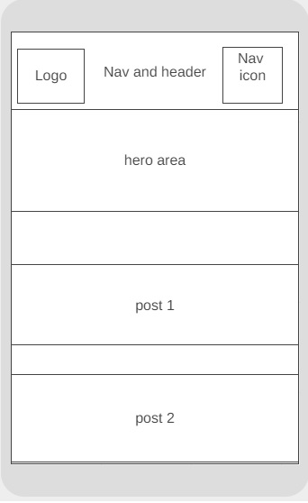
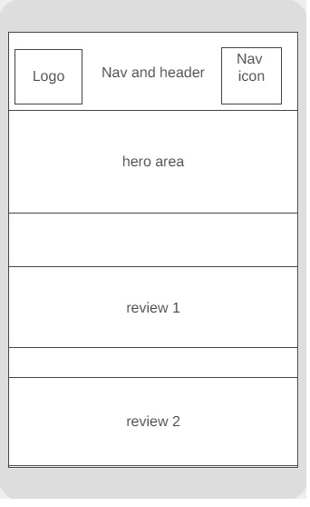

## Current Active Features

The website currently offers the user login/logout functionality aswell as an option to register an account if they dont yet have one. The user when logged in can easily manouvre the website due to its simplistic layout and can post a thread to start a discussion with other users and share their ideas, they can also leave a review of their experience with the website. 

## Potential Future Features

I would like to include options for users to categorize posts based on various filters aswell as options to favourite posts and have their own personal landing page for this.

## User Stories

Kanban board with user stories available at [User Stories Kanban board](https://github.com/users/john33mcd/projects/4), full list below.

* As a website user I can register for an account so that I can log in and add comments and posts

* As a Moderator I can assess posts and approve them so that posts are suitable for the website

* As Admin I can approve comments so that I can restrict content that should not be available on the site

* As a user I can view posts from other users and myself so that I can see and provide feedback if I want to

* As a user I can leave feedback for other users so that I can interact with the community

* As a website user I can log into my account so that I can use the website to post, edit and delete from my own personal account

* As a website user I can register for an account so that I can log in and add comments and posts

* As a website user I can leave a testimonial so that I can share my experience using the site

* As a user I can delete posts so that I can remove content from the website
 
* As a user I can edit a post so that I can change post details

* As a website user I can favorite posts so that I can see all my favorite posts in one place

* As a website user I can categorize posts so that I can see a unique selection of posts based on my own requirements

## Website Goals

### User Goals

The goal for a user is to make posts and comments and branch out their network depending on their own interests. The idea behind the website is to provide a platform for individuals to find like minded people and allow them to interact and engage with them.

### Admin Goals

As an admin the goal was to be able to monitor a blog application. Options to reject or delete posts or reviews that are unsuitable is important and has been implemented. Verification is in place for comments and posts so any unsuitable requests are denied. Users of the website can also be monitored through the admin panel.

## Testing

Automated testing unavailable due to error with database, could not get testing to work. Manual testing conducted. Tested all elements myself, logged in, signed out, registered accounts, posted, commented and left likes on posts. I had relatives and peers test the site and asked them to attempt to break elements of the site in any way they could. 

On the back of manual testing it was identified that there was no way to logout after having logged in and there was also no option to log in unless you first opted to sign in, buttons have been added to the footer in order to fix this problem.

## validation

### Lighthouse

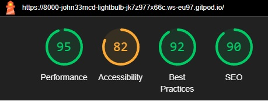

### W3C HTML

No errors were returned when HTML was passed through the official W3C HTML Validator. Template Literals were removed when the code was being run as the validator was giving errors regarding use of template literals.

### W3C CSS

No errors were returned when CSS was passed through the official W3C CSS Validator (Jigsaw Validator)

## Bugs and Issues

* Had an issue in which database migration failed on one occasion, jumping a migration and not allowing for subsequent migrations. Issue was that a non INT value was passed for the default option on fields in a model which could not accept INT value. in order to rectify error, edited __init__ file with the issue to a number then submitted all changes.

__BUG__ - slug = models.SlugField(default="", max_length=200, unique=True, null=False)

__FIX__ -

0003_post_author.py - changed default to 1.

* Had bug where no reverse match was available, this was due to a post with the title '-' throwing the error, rectified by removing this post in admin.

* Ran out of gitpod hours and received extra permissions through tutor support, migration of project resulted in env.py file being removed from new workspace causing project not to load, rectified by rebuilding env.py file.

## Unresolved Bugs and Issues

* Currently have an issue where automated testing will not function, the issue relates to the database, manual testing carried out to bypass the lack of automated testing.

## Deployment

- Install all dependencies to begin, add all dependencies to requirements.txt file using the pip3 freeze --local > requirements.txt command.

- Create django project and app using the relevant commands.

- Go to Heroku, click New on the dashboard, create new app, name the app and click create.

- link database on the elephantSQL.com website, create, name and plan was selected for new instance.

- set environment variables using env.py file in order to keep sensitive keys and files secure.

- get API key from external media host Cloudinary and add it to project.

- Add config vars on heroku for database, secret key and external media host (Cloudinary).

- connect to github account on Heroku, search for relevant repo on this project page and then build.

## Credits and References

- [Django To Do List App](https://www.youtube.com/watch?v=llbtoQTt4qw&t=90s), Dennis Ivy. Used to understand MVC relationships and implementation, to test views and url connection, used to set up model for users. Also utilised to understand login/registration functionality.

- Used Code Institutes I think therefore I blog sample project as a starting template, utilising models, admin, comments, posts and template codes as a foundation for my own project

- Palette taken from [mycolor](https://mycolor.space/)

- Footer positioning learned from [dev.to](https://dev.to/nehalahmadkhan/how-to-make-footer-stick-to-bottom-of-web-page-3i14)

- Used [Corey Schafer](https://www.youtube.com/watch?v=-s7e_Fy6NRU&t=1398s) to create post and delete functions.

- Used the following to implement unique [slugs](https://studygyaan.com/django/how-to-create-a-unique-slug-in-django?utm_content=cmp-true)

- [Stackoverflow](https://stackoverflow.com/questions/43879330/djangounable-to-compare-the-logged-in-user-with-the-author-of-the-post) utilized to check author and user authentication for buttons edit and delete.

- [Pexels](https://www.pexels.com/) used for post and detail images.

- Dropdown for review list learned from [stackoverflow](https://stackoverflow.com/questions/31130706/dropdown-in-django-model) and [stackoverflow2](https://stackoverflow.com/questions/66302329/how-to-create-dropdown-box-with-forms-modelform-in-django)

- codeblock for hero image area taken from [W3Schools](https://www.w3schools.com/howto/howto_css_hero_image.asp)

- [Wireframes](https://wireframe.cc/) created on Wireframes.cc.

- [Charts](https://lucidchart.com) created using Lucid chart.